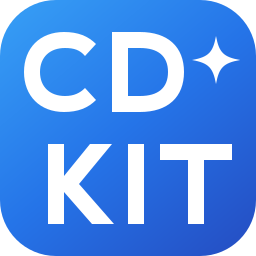
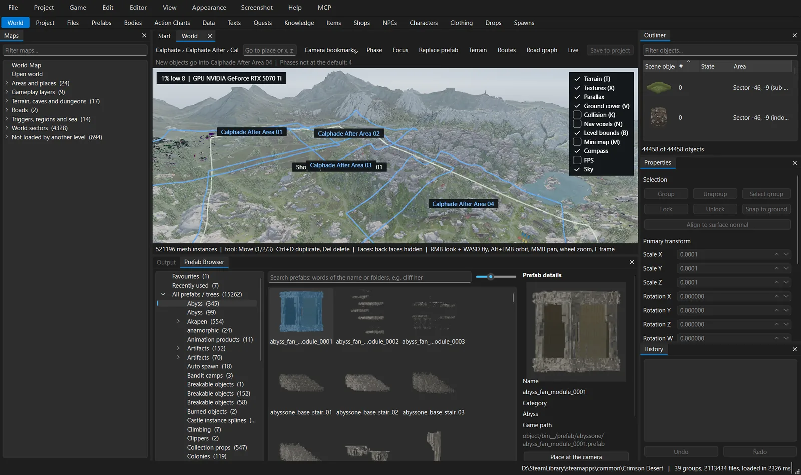

<h1 align="center">CDKit</h1>

<b>The modding toolkit for Crimson Desert</b> 
Edit the world, sculpt terrain, write quests, add characters – and install it all into the game with one click.

  <a href="https://moon-yungg.github.io/CDKit-Releases/">Website</a> ·
  <a href="https://github.com/Moon-yungg/CDKit-Releases/releases/latest">Download</a> ·
  <a href="https://github.com/Moon-yungg/CDKit-Releases/wiki">Guide</a> ·
  <a href="https://discord.gg/HfkShRJZU">Discord</a>

## Get started

1. Download `CDKit.zip` from the [latest release](https://github.com/Moon-yungg/CDKit-Releases/releases/latest).
2. Unpack it into a folder of your own (not the game folder, not `Program Files`).
3. Start `CDkit.exe` and follow the [getting started guide](https://github.com/Moon-yungg/CDKit-Releases/wiki/Getting-Started).

CDKit updates itself. It never overwrites the game's own files – mods are separate packages you can uninstall with one
click, and Steam's "Verify integrity of game files" restores the original game at any time.

---

CDKit is a free, fan-made modding tool, not affiliated with or endorsed by Pearl Abyss. Crimson Desert is a
trademark of its respective owner.
